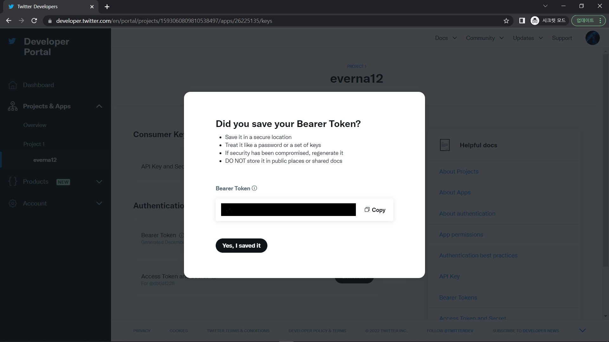
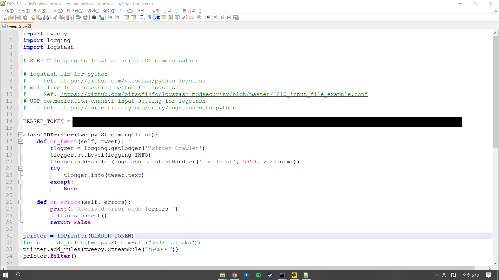

# ElasticSearch Twitter logging 
 

## Step1
우선 데이터를 분석하기 위해서 트위터 개발자 계정이 필요하다. 
계발자 계정이 있어야 트위터 플러그인에서 사용하는 API키값을 얻을 수 있다. 
트위터 개발자 계정을 만들고 로그인 한다. 
 
그 후 오른쪽 상단에 Developer portal 링크로 들어간다.
 
키를 얻기 위해서는 앱이 필요하다. 
 
 
사용 용도를 선택해주고 
 
앱 이릅을 정하고 Next 버튼을 누르면 
 
앱이 만들어진것을 확인할 수 있다. 
그리고 화면에 Bearer Token의 Regenerate 버튼을 클릭하면 
 
Bearer Token의 키 값을 받을 수 있다. 

## Step2
 
elasticsearch를 실행해주고, 
 
엘라스틱서치가 완전히 실행되면 키바나를 실행해준다. 
 
엘라스틱 서치와 키바나를 준비하는 동안 로그스태시config 폴더 내에 logstash-twitter.conf 설정 파일을 하나 만든다. 
위 config 파일은 정해진 경로에 bts_ko라는 인덱스를 만들어주는 설정이다. 
 
bin\logstash.bat =f config\logstash-twitter.conf 명령어를 입력하여 로그스태시를 실행시켜주고. 
정상적으로 실행된다면 엘라스틱서치에 bts_ko라는 인덱스가 생성된다.
 
bts_ko라는 비어있는 인덱스가 만들어진 것을 확인할 수 있다. 

## Step3
 
미리 준비한 tweetlog > 가상환경 폴더이다. 
가상환경 폴더에서 커맨드창을 실행 후 Scripts\activate 명령어를 입력하여 가상화 모드에 진입한다. 
 
가상화모드에 python 명령어를 입력하여 python이 설치되어 있는지 확인한다. 
 
그 후 가상화 모드에 pip install tweepy를 입력하여 설치를 진행하고 
 
pip install python-logstash를 입력하여 로그스태시를 설치한다. 

## Step4
환경이 다 준비 되었다면, 트위터에서 로깅을 하기위한 파일을 만든다.
 
위 사진의 파일은 Bearer_Token 키를 이용하여 "방탄소년단"이라는 키워드로 트위터에서 데이터를 로깅하기 위한 파이썬 파일이다.
 
가상화 환경에서 python tweepy2.py 명령어를 입력하여 파이썬 파일을 실행한다. 
 
그러면 실행되어있던 로그스태시 cmd 창에서 키워드를 통해 트위터에서 데이터를 로깅하는것을 볼 수 있다. 
충분히 데이터를 로깅한 후 종료하여 멈추고 키바나로 들어간다. 
 
bts_ko인덱스를 보면 3652개의 데이터가 쌓인 것을 볼 수 있다. 

## Step5
 
그 후 인덱스 이름과 같은 bts_ko라는 인덱스 패턴은 만든다. 
인덱스 패턴을 만든 후 키바나 Discover에 들어가 bts_ko인덱스 패턴은 선택한다.
 
우측 상단에 시간을 설정하여 트위터에서 로깅된 데이터를 분석할 수 있다. 
